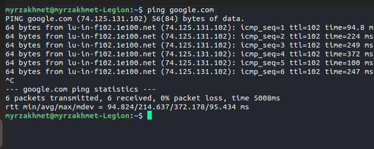

# kolesa-upgrade-homework-3

Дедлайн: 25.09 воскресенье 23:59

Домашнее задание состоит из 3 частей:

### 1. Практическая работа.

Запускаем программу с помощью команды `go run main.go` переходим на локальный хостинг [Cats](localhost:3000/). Выбираем количество котиков (от 1 до 10) указываем страницу с которого будет взята картинка и метод сортировки. Получаем картинки котиков.

### 2. Изучение утилиты `ping`.

`ping` предназначена для проверки качества соединения сети будь то глобальная сеть интернет или локальная сеть. `ping` отправляет по заданному IP-адреса пакеты данных и измеряет за какое время оно доставляется по адресу и обратно. 

#### ping windows

Команда `ping google.com`. По умолчанию отправляет 4 пакета по 32 байта данных и получает 32 байта. При отправке пакета выводит ответ от сайта к которому делался запрос, в ответе содержится размер данных, время которое тратится на отправку и отклик от сервера и время жизни пакета(сколько ходов оно сможет сделать перед тем как исчезнет). Затем как все пакеты будут доставлены и получены обратно расчитывается статистика. В статистике будет какого IP-адреса рассчитана статистика. По пакетам сколько доставлено, сколько получено и сколько потеряно. Приблизительное время прохождения туда и обратно в миллисекундах: минимальное, максимальное и среднее время.


#### ping linux

Команда `ping google.com` в linux имеет пару отличии. Первое пакеты будут отправлятся пока вы не остановите команду сочетанием клавиш `Ctrl + c`, второе по умолчанию размер отправляемого пакета 56 байта а размер получаемого пакета равна 64 байта,третье отличие есть дополнительный параметр `icmp_seq` это номер пакета, из этого можно понять если какой то номер пропускается он был потерян.



### 3. Изучение утилиты `curl`.

`curl` расшифровывается как `client URL` как понятно из названия `curl` делает запросы и получает ответы, возпроизводит отношение клиент-сервер. 

Простой пример `curl https://kolesa.kz/`, если сделать этот запрос, в качестве ответа мы получим исходный код сайта и если не указать протокол, исходник будет в формате `html`.

Рассмотрим `curl -I https://kolesa.kz/` здесь используется опция `-I`(`--head`), с ним мы получим заголов сайта точно такой же как в методе `GET`, но без тела. 

```bash
HTTP/2 200 
server: nginx
date: Sun, 25 Sep 2022 12:35:39 GMT
content-type: text/html; charset=UTF-8
set-cookie: klssid=pt9fajv2ucmlqulrv6kt5ob971; expires=Sun, 25-Sep-2022 13:05:39 GMT; Max-Age=1800; path=/; domain=.kolesa.kz; secure; HttpOnly
expires: Thu, 19 Nov 1981 08:52:00 GMT
cache-control: no-store, no-cache, must-revalidate
pragma: no-cache
set-cookie: old_ssid=deleted; expires=Thu, 01-Jan-1970 00:00:01 GMT; Max-Age=0; path=/; secure
set-cookie: is_returning=0; path=/; secure
alt-svc: h3=":443"; ma=2592000,h3-29=":443"; ma=2592000,h3-Q050=":443"; ma=2592000,h3-Q046=":443"; ma=2592000,h3-Q043=":443"; ma=2592000,quic=":443"; ma=2592000; v="46,43"

```

`HTTP/2 200` здесь указано что тип сетевого протокола `HTTP` версия `2`. `200` код статуса, означает соединение установлено без ошибок.

`server: nginx` это сервер на котором функционирует данный сайт.

`date: Sun, 25 Sep 2022 12:35:39 GMT` дата и время запроса.

`content-type: text/html; charset=UTF-8` тип контента `text/html` то есть тело которое вернет нам сервер будет в формате `html`. `charset=UTF-8` метод кодировки символов.

`set-cookie: ` отправляет клиенту данные, и в следующий раз когда клиент будет заходить на этот сайт, клиент будет отправлять эти данные серверу.

`expires: Thu, 19 Nov 1981 08:52:00 GMT` в данном заголовке указано что данный ресурс уже устарел. `expires` срок годности ответа сервера.

`cache-control:`  инструкция для кеширования.

`pragma: ` используется для обратной совместимости с клиентом
